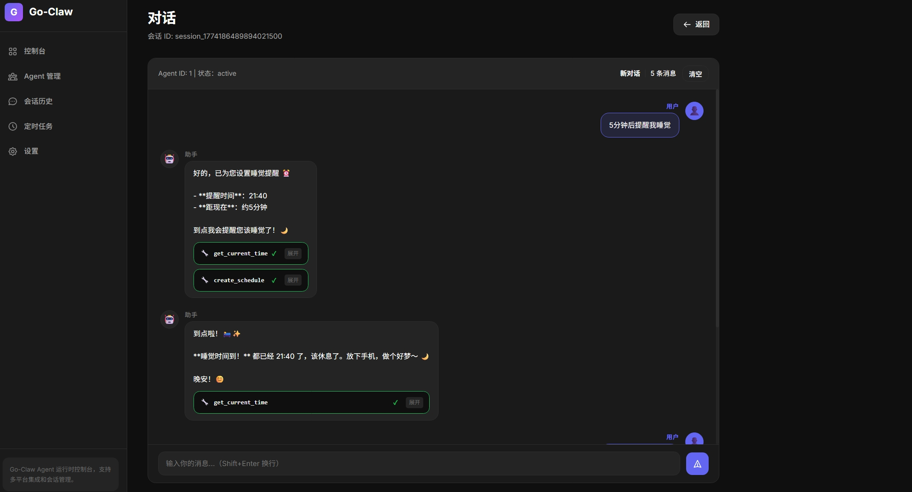

# Go-Claw

Go-Claw 是一个功能强大的 AI Agent 框架，支持工具调用、会话管理、定时任务和实时消息推送。

## ✨ 特性

### 核心功能
- **工具调用** - Agent 可以循环执行工具（命令、文件、待办事项等）
- **会话管理** - 使用 SQLite 持久化对话历史
- **多平台支持** - Telegram、飞书、Discord 集成
- **上下文管理** - 工作区文件支持（SOUL.md、USER.md、MEMORY.md 等）
- **多 LLM 提供商** - OpenAI、Anthropic、Ollama

### 高级功能
- **定时任务系统** - 支持一次性提醒、周期性任务和 Cron 表达式
- **WebSocket 实时推送** - 前端自动接收新消息，无需轮询
- **Dashboard Web 界面** - 可视化管理会话、Agent 和定时任务
- **RESTful API** - 完整的 API 用于集成和自动化

## 🚀 快速开始

### 构建 CLI
```bash
go build -o go-claw-cli.exe ./cmd/cli/...
```

### 运行 CLI
```bash
./go-claw-cli.exe
```

### 运行 Dashboard
```bash
go build -o go-claw-server.exe ./cmd/go-claw/...
./go-claw-server.exe
```

然后访问 http://localhost:8080

## 📋 CLI 命令

| 命令 | 描述 |
|------|------|
| `/new` | 开始新的对话 |
| `/sessions` | 列出所有会话 |
| `/switch <id>` | 切换到指定会话 |
| `/delete <id>` | 删除会话 |
| `/clear` | 清除当前对话 |
| `/help` | 显示帮助信息 |

## 📁 项目结构

```
go-claw/
├── cmd/
│   ├── cli/              # CLI 应用程序
│   └── go-claw/          # 服务器应用程序
├── internal/
│   ├── agent/            # Agent 核心（manager.go, agent.go, session.go, context.go）
│   ├── llm/              # LLM 提供商（OpenAI, Anthropic, Ollama）
│   ├── tools/            # 工具实现（exec, file, todo, time 等）
│   ├── storage/          # 数据库模型和仓库
│   ├── server/           # HTTP/WebSocket 服务器
│   ├── dashboard/        # Dashboard Web 界面
│   ├── scheduler/        # 定时任务调度器
│   └── platform/         # 平台集成（Telegram, Feishu）
├── workspace/            # Agent 工作区文件
│   ├── SOUL.md          # 个性配置
│   ├── USER.md          # 用户信息
│   ├── MEMORY.md        # 记忆存储
│   ├── LEARNINGS.md     # 学习记录
│   └── PROJECTS.md      # 项目信息
└── README.md
```

## 🎯 定时任务系统

### 任务类型
- **一次性提醒** (`at`) - 在指定时间执行一次
- **周期性任务** (`every`) - 每隔固定时间执行
- **Cron 任务** (`cron`) - 使用 Cron 表达式定义执行时间

### 会话目标
- `main` - 使用主会话上下文
- `isolated` - 在专用会话中运行
- `current` - 绑定到当前会话
- `session:<id>` - 绑定到指定会话

### 负载类型
- `systemEvent` - 主会话事件
- `agentTurn` - 隔离的 Agent 回合

### API 示例

```bash
# 创建定时任务
POST /api/scheduled-tasks
{
  "name": "每日新闻",
  "kind": "cron",
  "cron_expression": "0 8 * * *",
  "input": "获取今日新闻摘要",
  "session_target": "main",
  "payload_kind": "systemEvent"
}

# 获取任务列表
GET /api/scheduled-tasks

# 删除任务
DELETE /api/scheduled-tasks?id=1
```

## 🔌 WebSocket 推送

Dashboard 使用 WebSocket 实现实时消息推送：

1. 前端建立 WebSocket 连接到 `/ws`
2. 发送认证消息包含 `session_id`
3. 后端验证并将客户端加入对应会话
4. 新消息到达时自动推送到前端

### 消息格式

```json
{
  "type": "new_message",
  "payload": {
    "session_id": "session_1",
    "message": {
      "content": "回复内容",
      "tool_calls": [
        {
          "tool_name": "execute_command",
          "input": "ls -la",
          "output": "文件列表",
          "success": true
        }
      ]
    }
  }
}
```

## 🛠️ 工具系统

### 内置工具
- **execute_command** - 执行系统命令
- **read_file** - 读取文件内容
- **write_file** - 写入文件
- **list_files** - 列出目录文件
- **search_files** - 搜索文件
- **todo_write** - 管理待办事项
- **create_scheduled_task** - 创建定时任务
- **create_reminder** - 创建一次性提醒

### 工具调用流程
1. Agent 分析用户请求
2. 决定调用哪些工具
3. 并行执行工具
4. 收集结果并生成回复
5. 将结果保存到会话历史

## 🌐 Dashboard 界面

访问 http://localhost:8080 访问 Dashboard：

- **会话列表** - 查看所有对话历史
- **Agent 管理** - 配置和管理 Agent
- **定时任务** - 创建、编辑、删除定时任务
- **任务日志** - 查看任务执行历史
- **设置** - 系统配置

### 界面预览



## 📝 工作区文件

Go-Claw 使用特殊文件来维护上下文，默认位于 `~/.go-claw` 目录：

- **SOUL.md** - Agent 的个性和行为准则
- **USER.md** - 用户偏好和项目信息
- **MEMORY.md** - 长期记忆存储
- **LEARNINGS.md** - 从经验中学习
- **PROJECTS.md** - 项目跟踪

### 工作区位置

- **默认位置**: `~/.go-claw` (用户目录下的 .go-claw 文件夹)
- **配置文件**: `~/.go-claw/config.yaml`
- **数据库**: `~/.go-claw/data/go-claw.db`

可以通过配置文件中的 `work_dir` 和 `database.path` 选项自定义位置：

```yaml
work_dir: /path/to/your/workspace
database:
  path: /path/to/your/database.db
```

## 🔧 配置

### 首次运行

第一次运行时，如果找不到配置文件，程序会自动在 `~/.go-claw/config.yaml` 创建默认配置文件。

### 配置文件位置

配置文件会按以下顺序查找（找到第一个就使用）：
1. `./config.yaml` - 当前目录
2. `./configs/config.yaml` - configs 目录  
3. `~/.go-claw/configs/config.yaml` - 用户目录（默认创建位置）

### 配置文件示例

```yaml
server:
  host: "127.0.0.1"
  port: 18789
  
database:
  type: "sqlite"
  path: "~/.go-claw/data/go-claw.db"

llm_provider:
  provider: "ark"
  model: "minimax-m2.5"
  base_url: "https://ark.cn-beijing.volces.com/api/coding/v3"
  api_key: "YOUR_API_KEY"  # 请替换为你的 API 密钥
  max_tokens: 200000
  timeout: 120s
  temperature: 0.2

skills:
  directory: "./skills"
  max_injected_skills: 3
  max_injection_chars: 4000

# 自定义工作区目录（可选）
# work_dir: "./workspace"

log:
  level: "info"
  format: "console"
```

### 重要配置项

**必须配置：**
- `llm_provider.api_key` - 你的 LLM API 密钥

**可选配置：**
- `work_dir` - 工作区目录，默认 `~/.go-claw`
- `database.path` - 数据库路径，默认 `~/.go-claw/data/go-claw.db`
- `server.port` - HTTP 服务端口，默认 `18789`

## 🤝 API 接口

### 会话管理
- `GET /api/sessions` - 获取会话列表
- `GET /api/sessions/:id/messages` - 获取会话消息
- `POST /api/sessions/:id/execute` - 执行 Agent

### Agent 管理
- `GET /api/agents` - 获取 Agent 列表
- `PUT /api/agents/:id` - 更新 Agent 配置

### 定时任务
- `GET /api/scheduled-tasks` - 获取任务列表
- `POST /api/scheduled-tasks` - 创建任务
- `PUT /api/scheduled-tasks/:id` - 更新任务
- `DELETE /api/scheduled-tasks/:id` - 删除任务
- `GET /api/task-logs` - 获取任务执行日志

## 📚 开发指南

### 添加新工具

1. 在 `internal/tools` 目录创建新文件
2. 实现工具函数
3. 在工具注册表中注册

### 添加新平台

1. 在 `internal/platform` 目录创建新文件
2. 实现平台接口
3. 在配置中添加平台设置

### 自定义 Agent 行为

1. 编辑 `workspace/SOUL.md` 修改个性
2. 编辑 `workspace/USER.md` 添加用户偏好
3. 通过 Dashboard 调整 Agent 配置

## 🐛 故障排除

### 常见问题

**Q: WebSocket 连接失败**
- 检查服务器是否启动
- 确认端口配置正确
- 查看浏览器控制台错误信息

**Q: 定时任务不执行**
- 检查 Cron 表达式格式（5 个字段：分 时 日 月 周）
- 确认任务状态为 active
- 查看任务日志了解执行详情

**Q: 工具调用失败**
- 检查工具参数是否正确
- 查看 Agent 日志了解错误详情
- 确认有执行权限

## 📄 许可证

MIT License

## 🙏 致谢

感谢所有贡献者和开源项目！
